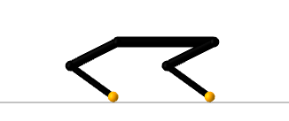

# RoboDojo.jl
[](https://github.com/thowell/RoboDojo.jl/actions/workflows/CI.yml)
[](https://codecov.io/gh/thowell/RoboDojo.jl)

Prototype differentiable simulator for robotic systems. This repository includes models for planar hopper, biped, and quadruped systems. 

Systems are represented in minimal coordinates and contact impulses are computed at each time step by solving a [nonlinear complementarity problem (NCP)](https://en.wikipedia.org/wiki/Nonlinear_complementarity_problem) using a custom [interior-point solver](src/solver/interior_point.jl). Gradients through the dynamics are efficiently computed via the [implicit-function theorem](https://en.wikipedia.org/wiki/Implicit_function_theorem) applied to the NCP optimality conditions.

For more details, see our paper: [Dojo: A Differentiable Simulator for Robotics](https://arxiv.org/abs/2203.00806) and checkout our full simulator: [Dojo](https://github.com/dojo-sim/Dojo.jl).

## Installation
`RoboDojo` can be added via the Julia package manager (type `]`):
```julia
pkg> add RoboDojo
```

## Systems
### Hopper 


### Biped 


### Quadruped 


## Examples 

Please see the following for examples using this package: 

- [Trajectory Optimization with Optimization-Based Dynamics](https://github.com/thowell/optimization_dynamics) 
- [Fast Contact-Implicit Model-Predictive Control](https://github.com/dojo-sim/ContactImplicitMPC.jl)
